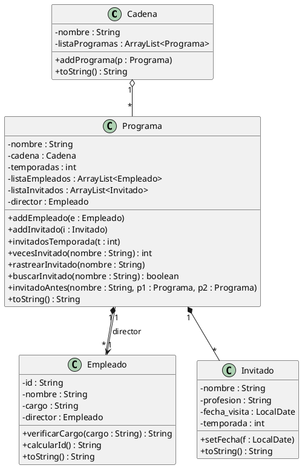

# Práctica 1: **El Formiguero y La Rebelión**

Aplicación desarrollada en Java para gestionar información de programas de televisión, sus cadenas, empleados e invitados. Proyecto de Programación – 1º DAM (IES Mutxamel).

---

# 📚 Índice

- [Descripción general](#descripción-general)
- [Estructura de clases](#estructura-de-clases)
    - [Clase Cadena](#clase-cadena)
    - [Clase Programa](#clase-programa)
    - [Clase Empleado](#clase-empleado)
    - [Clase Invitado](#clase-invitado)
- [Diagrama UML](#diagrama-uml)
- [Ejemplo de funcionamiento](#ejemplo-de-funcionamiento)
- [Plan de pruebas](#plan-de-pruebas)
- [Estructura del proyecto](#estructura-del-proyecto)
- [Compilación y ejecución](#compilación-y-ejecución)
- [Autoría](#autoría)
- [Licencia](#licencia)

---

# Descripción general

La aplicación simula el funcionamiento de dos programas de televisión enfrentados mediáticamente. Permite registrar empleados, invitados, temporadas y fechas de visita para analizar datos de forma objetiva.

Clases principales:
- `Cadena`
- `Programa`
- `Empleado`
- `Invitado`
- `AppProgramas`

---

# Estructura de clases

## Clase Cadena
- `nombre : String`
- `listaProgramas : ArrayList<Programa>`

Métodos:
- `addPrograma(Programa p)`
- `toString()`

---

## Clase Programa
- `nombre : String`
- `cadena : Cadena`
- `temporadas : int`
- `listaEmpleados : ArrayList<Empleado>`
- `listaInvitados : ArrayList<Invitado>`
- `director : Empleado`

Métodos:
- `addEmpleado(Empleado e)`
- `addInvitado(Invitado i)`
- `invitadosTemporada(int temporada)`
- `vecesInvitado(String nombre)`
- `rastrearInvitado(String nombre)`
- `buscarInvitado(String nombre)`
- `static invitadoAntes(String nombre, Programa p1, Programa p2)`
- `toString()`

---

## Clase Empleado
- `id : String`
- `nombre : String`
- `cargo : String`
- `director : Empleado`

Reglas:
- Cargos válidos: `director`, `técnico`, `presentador`, `colaborador`
- Otros valores → `pte`
- Si es director → `director = null`

---

## Clase Invitado
- `nombre : String`
- `profesion : String`
- `fecha_visita : LocalDate`
- `temporada : int`

Constructor:
- Pide año, mes y día al usuario
- Crea un `LocalDate` con `LocalDate.of()`

---

# Diagrama UML

## Compilación y ejecución

@enduml

