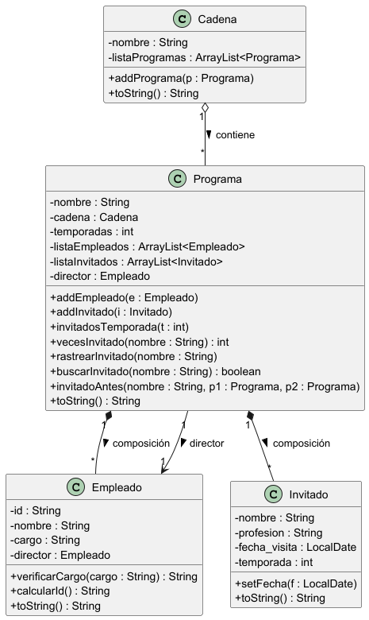
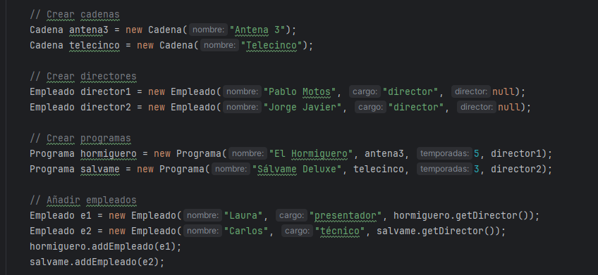
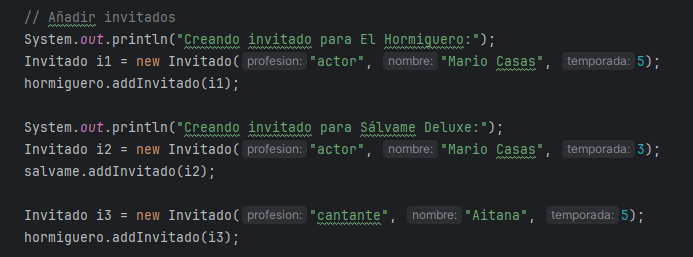
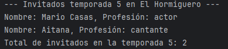
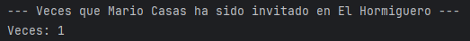
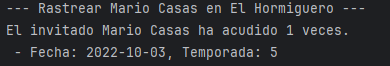
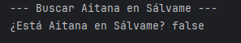
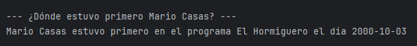

# Práctica 1: El Formiguero y La Rebelión
 Kevin Muñoz Corcoles - 1º DAM (IES Mutxamel).

---

# 📚 Índice

- [Descripción general](#descripción-general)
- [Estructura de clases](#estructura-de-clases)
    - [Clase Cadena](#clase-cadena)
    - [Clase Programa](#clase-programa)
    - [Clase Empleado](#clase-empleado)
    - [Clase Invitado](#clase-invitado)
- [Diagrama UML](#diagrama-uml)
- [Compilación y ejecución](#compilación-y-ejecución)

---

# Descripción general

El codigo simula la aplicacion que se nos pide que es una app que registre el seguimiento de dos cadenas, de sus programas, directores, empleados y invitados. Con unas funcionalidades que se nos piden como metodos

Clases principales:
- `Cadena`
- `Programa`
- `Empleado`
- `Invitado`
- `AppProgramas`

---

# Estructura de clases

## Clase Cadena
- `nombre : String`
- `listaProgramas : ArrayList<Programa>`

Métodos:
- `addPrograma(Programa p)`
- `toString()`

---

## Clase Programa
- `nombre : String`
- `cadena : Cadena`
- `temporadas : int`
- `listaEmpleados : ArrayList<Empleado>`
- `listaInvitados : ArrayList<Invitado>`
- `director : Empleado`

Métodos:
- `addEmpleado(Empleado e)`
- `addInvitado(Invitado i)`
- `invitadosTemporada(int temporada)`
- `vecesInvitado(String nombre)`
- `rastrearInvitado(String nombre)`
- `buscarInvitado(String nombre)`
- `static invitadoAntes(String nombre, Programa p1, Programa p2)`
- `toString()`

---

## Clase Empleado
- `id : String`
- `nombre : String`
- `cargo : String`
- `director : Empleado`

Reglas:
- Cargos válidos: `director`, `técnico`, `presentador`, `colaborador`
- Otros valores → `pte`
- Si es director → `director = null`

---

## Clase Invitado
- `nombre : String`
- `profesion : String`
- `fecha_visita : LocalDate`
- `temporada : int`

Constructor:
- Pide año, mes y día al usuario
- Crea un `LocalDate` con `LocalDate.of()`

---

# Diagrama UML

# Compilación y ejecución

Enseñare como se copila y se va ejecutando AppProgramas probando todas las clases y metodos cumpliendo sus funciones

## Creamos Cadenas, directores, programas y empleados

Los podemos crear directamente ya que no nos piden que se haga algo por teclado

## Creamos invitados

Como nos piden tenemos que poner por teclado que fecha fue realizada la visita

## Probar el metodo InvitadosTemporada

a partir de este metodo le podemos preguntar que invitados vinieron en X temporada y nos devolvera los nombres, profesiones y el total

## Probar el metodo VecesInvitado

El metodo nos dira cuantas veces fue invitado a un programa

## Probar el metodo RastrearInvitado

Nos dice cuantas veces a acudido, las fechas y temporadas que fue

## Probar el metodo buscarInvitado

Nos dice si alguna vez el invitado estuvo

## Probar el metodo invitadoAntes

El metodo busca cuando fue invitado en los dos programas y dice donde fue invitado antes

@enduml

