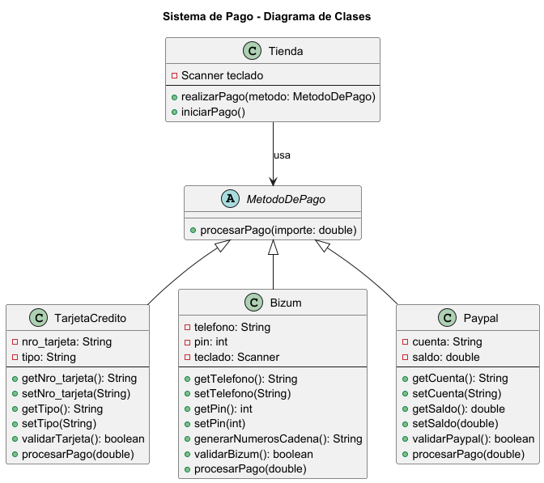
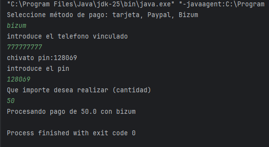
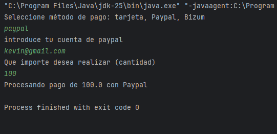
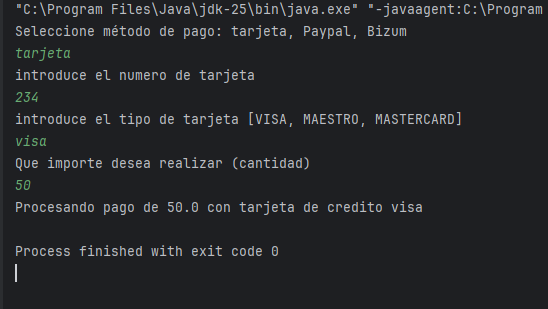
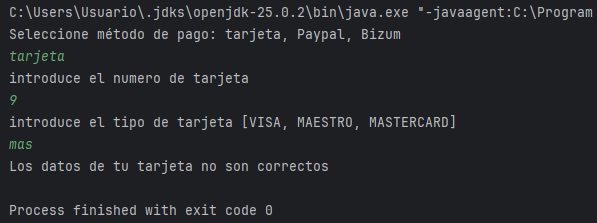
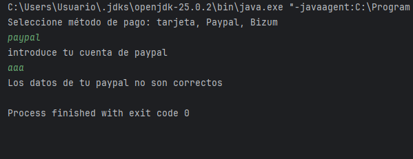
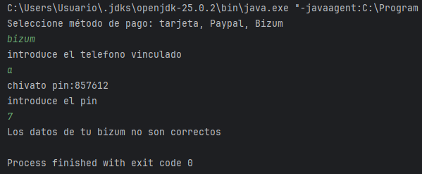

# Práctica: Sistema de Pago
**Kevin Muñoz Corcoles – 1º DAM (IES Mutxamel)**

---

# Descripción general

Este proyecto implementa un sistema de pagos sencillo que permite al usuario seleccionar entre distintos métodos de pago y procesar una compra.  
Como se nos ha pedido para poder ayudar a nuestro vendedor de turrones profesional

Clases principales del sistema:

- `Tienda`
- `MetodoDePago` (abstracta)
- `TarjetaCredito`
- `Bizum`
- `Paypal`

---

# Estructura de clases

## Clase Tienda

**De que se encarga:**  
Gestiona la interacción con el usuario, solicita datos y ejecuta el pago mediante el método seleccionado.

**Métodos principales:**
- `realizarPago(MetodoDePago metodo)`
- `iniciarPago()`

---

## Clase MetodoDePago

**Tipo:** Clase abstracta

Define que todos los metodos de pago tiene que tener un procesar pago.

**Método abstracto:**
- `procesarPago(double importe)`

---

## Clase TarjetaCredito

**Atributos:**
- `nro_tarjeta : String`
- `tipo : String`

**Métodos:**
- `validarTarjeta()`
- `procesarPago(double importe)`

**Validación:**
- El número no puede superar 16 caracteres
- El tipo debe coincidir con uno de los permitidos

---

## Clase Bizum

**Atributos:**
- `telefono : String`
- `pin : int`

**Métodos:**
- `generarNumerosCadena()`
- `validarBizum()`
- `procesarPago(double importe)`

**Validación:**
- Teléfono de 9 dígitos
- PIN introducido debe coincidir con el generado

---

## Clase Paypal

**Atributos:**
- `cuenta : String`
- `saldo : double`

**Métodos:**
- `validarPaypal()`
- `procesarPago(double importe)`

**Validación:**
- La cuenta debe cumplir el formato de correo electrónico

---

# Diagrama UML

# Compilación y ejecución

## Probar el correcto funcionamiento de los tres metodos de pago que tenemos

- Bizum

Comprobamos como funciona el bizum pidiendo los datos y introduciendo el pin que se nos chiva, nos verifica y realizamos el pago

- Paypal

Comprobamos como funciona con Paypal pidiendo los datos y introduciendo el pin que se nos chiva, nos verifica y realizamos el pago

- Tarjeta

Comprobamos como funciona con tarjeta pidiendo los datos y introduciendo el pin que se nos chiva, nos verifica y realizamos el pago

- opciones de fallo

no introducir bien el metodo de pago

no introducir bien los datos de la tarjeta

no introducir bien los datos del paypal

no introducir bien los datos del paypal

@enduml

